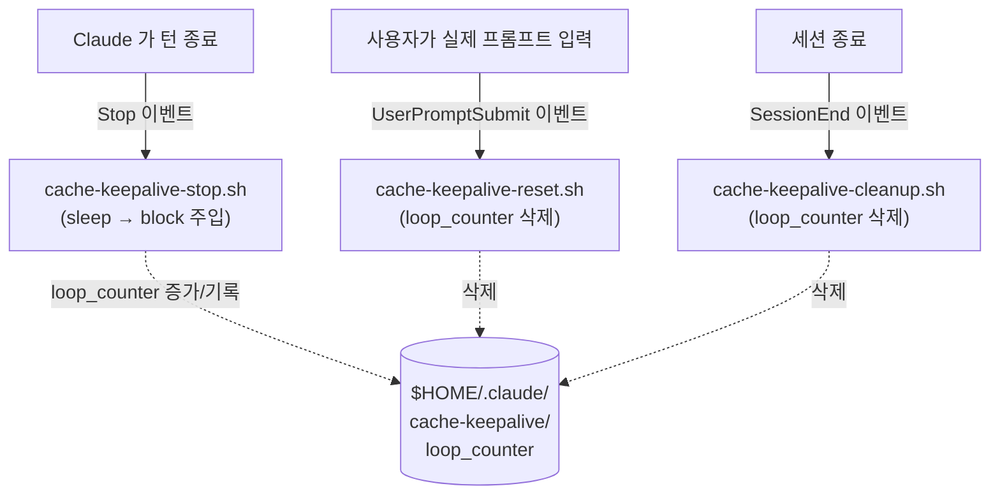
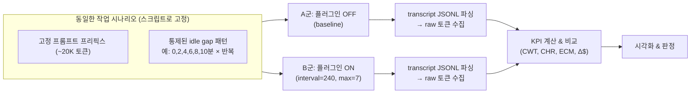

# Claude Code KV 캐시 keep-alive 의 이론적 배경과 성능 평가 전략

> 대상 저장소: [`yujiachen-y/claude-code-cache-keepalive`](https://github.com/yujiachen-y/claude-code-cache-keepalive)
> 분석 범위: README 의 이론적 근거 + 플러그인 전체 코드베이스(hooks + shell scripts)
> 작성일: 2026-06-22

---

## 0. 한눈에 보는 요약 (TL;DR)

- **무엇을 하는가**: Claude Code 가 한 턴(turn)을 끝내면 발생하는 `Stop` 훅을 가로채서, 캐시 TTL(5분)이 만료되기 직전에 **아주 싼 "keep-alive 턴"** 을 한 번 끼워 넣는다.
- **왜 동작하는가**: Anthropic 프롬프트 캐시는 **"캐시 읽기(read)가 성공하면 TTL 이 다시 5분으로 리셋된다"** 는 성질을 갖는다. 따라서 만료 직전에 캐시를 한 번 읽기만 해도 캐시가 계속 살아 있다.
- **왜 이득인가**: 캐시 **읽기**는 캐시 **쓰기**보다 약 **12.5배** 싸다. 긴 idle(생각하는 시간) 구간에서 매번 전체 프롬프트를 다시 캐시에 쓰는(rewrite) 대신, 싼 읽기로 캐시를 유지하면 토큰 비용이 크게 줄어든다.
- **언제 손해인가**: Pro/Max 구독제(요청 횟수 기준 과금)에서는 keep-alive 턴이 그냥 쿼터만 갉아먹는다. **API 토큰 과금에서만 이득**이다.
- **전제의 취약성**: "읽기가 TTL 을 리셋한다"는 것은 문서화되어 있지만 **계약상 보장은 아니다**. Anthropic 이 2026년 3월에 기본 TTL 을 1시간 → 5분으로 조용히 바꾼 전례가 있다.

---

## 1. 배경: 왜 이 플러그인이 생겼는가

### 1.1 사건의 발단

```
2026-03   Anthropic 이 Claude Code 의 기본 프롬프트 캐시 TTL 을
          1시간(1h) → 5분(5m) 으로 "조용히" 변경
              │
              ▼
   사용자가 5분 이상 "생각하는 시간"(idle)을 가질 때마다
   캐시가 만료되어 매 턴 full cache rewrite 비용이 청구됨
              │
              ▼
   한 사용자가 추적한 초과 청구액:
     · Sonnet-4.6  ≈ $949
     · Opus-4.6    ≈ $1,582  (이 중 $1,198 이 한 달에 집중)
              │
              ▼
   GitHub issue anthropics/claude-code#46829 로 공론화
              │
              ▼
   이 플러그인 = 그 회귀(regression)에 대한 워크어라운드(workaround)
```

핵심 문제는 **"생각하는 시간(idle gap)이 캐시 TTL 보다 길면, 다음 턴이 캐시 미스가 되어 전체 프리픽스를 다시 캐시에 써야 한다"** 는 데 있다. TTL 이 1시간일 때는 사람의 자연스러운 사고 휴지(休止)가 거의 다 캐시 안에 들어왔지만, 5분으로 줄면서 대부분의 휴지가 캐시 밖으로 튕겨 나갔다.

---

## 2. 이론적 핵심 ①: Transformer KV 캐시란 무엇인가

이 플러그인이 다루는 "캐시"는 본질적으로 **Transformer 의 KV(Key-Value) 캐시**를 서버 측에서 재사용하는 메커니즘이다. 비용 구조를 이해하려면 먼저 이 부분을 알아야 한다.

### 2.1 Prefill 과 KV 캐시

LLM 추론은 두 단계로 나뉜다.

```
┌──────────────────────────────────────────────────────────────┐
│  PREFILL (프리필) — 프롬프트 전체를 한 번에 forward            │
│                                                                │
│   토큰들:  [t1] [t2] [t3] ... [tN]   (프롬프트 프리픽스)       │
│              │    │    │         │                             │
│              ▼    ▼    ▼         ▼                             │
│   각 레이어 L 마다, 각 토큰마다 K, V 벡터를 계산:             │
│        K[L][i], V[L][i]    ← 이게 "KV 캐시"                    │
│                                                                │
│   비용:  O(N) 토큰 × O(L) 레이어 × attention 연산              │
│          → 이 무거운 계산이 "cache write" 의 실체              │
└──────────────────────────────────────────────────────────────┘
                              │
                              ▼
┌──────────────────────────────────────────────────────────────┐
│  DECODE (디코드) — 답변을 한 토큰씩 생성                       │
│   새 토큰은 캐시된 K,V 전체에 attention 만 하면 됨            │
│   → 프리픽스를 "다시 계산"할 필요가 없음                       │
└──────────────────────────────────────────────────────────────┘
```

### 2.2 왜 캐시 읽기가 싼가 (12.5x 의 근원)

| 동작 | 서버가 실제로 하는 일 | 상대 비용 |
| :--- | :--- | :--- |
| **Cache write** | 프리픽스 N개 토큰을 **다시 prefill** 하여 KV 텐서를 계산하고 저장 | 무거움 (1.25x base) |
| **Cache read** | 저장돼 있던 KV 텐서를 **그대로 로드** (재계산 없음) | 가벼움 (0.1x base) |

> 읽기는 "이미 계산된 KV 텐서를 GPU 메모리/스토리지에서 꺼내 오는" 일이고, 쓰기는 "그 KV 텐서를 처음부터 계산하는" 일이다. 계산을 건너뛰는 만큼 싸다. 이것이 **0.1x vs 1.25x → 약 12.5배** 차이의 물리적 근거다.

### 2.3 TTL: 캐시는 영원하지 않다

서버에 KV 텐서를 무한정 들고 있을 수 없으므로(GPU/스토리지 비용), 각 캐시 엔트리에는 **TTL(Time-To-Live)** 이 붙는다.

```
        cache write              아무 요청 없음 (idle)
   t=0 ───────────────▶ 캐시 생성, TTL 타이머 = 300s 시작
                              │
                              │   ⏳ idle ...
                              ▼
   t=300s  ────────────▶ TTL 만료 → KV 텐서 폐기(evict)
                              │
                              ▼
   다음 턴은 캐시 미스 → 전체 프리픽스를 다시 write (비쌈!)
```

---

## 3. 이론적 핵심 ②: 이 플러그인이 악용하는 단 하나의 불변식

README 의 "Theoretical basis" 섹션이 의존하는 명제는 **딱 하나**다.

> ### 📌 "성공한 캐시 읽기는 TTL 을 리셋한다 (A successful cache read refreshes the cache's TTL)."

이 명제가 참이면, 만료 직전에 **아무 의미 없는 싼 읽기 요청 한 번**으로 캐시를 또 5분 연장할 수 있다.

```
   write       read(refresh)   read(refresh)   read(refresh)
   1.25x          0.1x            0.1x            0.1x
    │              │               │               │
 t=0 ───── 240s ── ●───── 240s ──●───── 240s ──●─────▶ 시간
    │              ↑               ↑               ↑
    └ TTL=300s 시작  TTL 리셋        TTL 리셋        TTL 리셋
                   (60s 안전마진)   ...계속 살아있음...

   → 사람이 28분을 "생각"해도, 그 사이 캐시는 한 번도 안 죽음
   → 비용은 write 1번 + read 여러 번 (= 거의 공짜)
```

이 트릭은 이 플러그인만의 발명이 아니라, 다음 도구들이 모두 쓰는 **검증된 패턴**이다.

- **Aider** 의 `--cache-keepalive-pings` (빌트인)
- **Cache-Refresh-SillyTavern** (긴 대화에서 ~89% 비용 절감 보고)
- **ClaudeMind** 의 빌트인 핑어 (5분 → 60분으로 유효 TTL 확장, 손익분기 = 후속 질문 2개)
- **Cline** 커뮤니티 토론 [#414](https://github.com/cline/cline/discussions/414) (수학적 분석의 원전)

### 3.1 손익분기 수학 (cline #414, cspotcode)

> "첫 메시지가 1.25x 비용으로 캐시를 채우고, 그걸 0.1x 비용으로 6번 핑한 뒤, 두 번째 메시지를 보낸다 → 1.25 + (6+1) × 0.1 = **1.95x 비용으로 2x 요청**을 처리한다."

| 시나리오 (6분 idle gap) | 비용 | 설명 |
| :--- | :--- | :--- |
| **Naive (keep-alive 없음)** | 2.5x | full write 2번 (1.25x + 1.25x) |
| **Keep-alive (45초 간격 6핑)** | 1.95x | write 1번 + read 7번 |
| **절감** | **~22%** | gap 이 길수록 절감폭 급증 |

---

## 4. 코드베이스 해부: 어떻게 구현했는가

저장소는 **플러그인 + 단일 플러그인 마켓플레이스** 두 역할을 겸한다. 핵심은 **3개의 훅 + 3개의 셸 스크립트**, 데몬도 tmux 도 Python 도 curl 도 API 키도 없다.

### 4.1 파일 구조

```
claude-code-cache-keepalive/
├── .claude-plugin/marketplace.json          # 마켓플레이스 카탈로그
├── plugins/cache-keepalive/
│   ├── .claude-plugin/plugin.json           # 매니페스트 + userConfig (3개 옵션)
│   ├── hooks/hooks.json                      # Stop / UserPromptSubmit / SessionEnd 배선
│   └── scripts/
│       ├── cache-keepalive-stop.sh           # ★ 핵심: sleep-and-block 루프
│       ├── cache-keepalive-reset.sh          # 실제 프롬프트 시 카운터 리셋
│       └── cache-keepalive-cleanup.sh        # 세션 종료 시 카운터 정리
├── LICENSE (MIT)
└── README.md
```

### 4.2 훅 배선 (hooks.json) — 3개 이벤트, 각각의 책임



| 훅 이벤트 | 스크립트 | 역할 |
| :--- | :--- | :--- |
| `Stop` | `cache-keepalive-stop.sh` | 턴이 끝나면 `interval` 만큼 자고, `block` JSON 을 뱉어 새 턴 강제 |
| `UserPromptSubmit` | `cache-keepalive-reset.sh` | 사람이 진짜 입력하면 루프 카운터를 0으로 (다음 idle 새 출발) |
| `SessionEnd` | `cache-keepalive-cleanup.sh` | 세션 끝나면 카운터 파일 정리 (다음 세션 깨끗하게) |

### 4.3 핵심 로직: `cache-keepalive-stop.sh` 흐름

```mermaid
flowchart TD
    START["Stop 훅 발화"] --> CFG["설정 로드<br/>INTERVAL=240, MAX_LOOPS=7<br/>(plugin config → env → default 순)"]
    CFG --> READ["loop_counter 파일 읽기 (count)"]
    READ --> VALID{"count 가<br/>숫자인가?"}
    VALID -->|아니오| ZERO["count = 0"]
    VALID -->|예| CHECK
    ZERO --> CHECK{"count ≥ MAX_LOOPS?"}
    CHECK -->|"예 (한도 초과)"| EXIT0["로그 남기고<br/>counter 삭제<br/>exit 0 → Stop 정상 진행<br/>(= 사용자 입력 대기)"]
    CHECK -->|"아니오"| SLEEP["next = count+1<br/>sleep INTERVAL 초"]
    SLEEP --> WRITE["counter 파일에 next 기록"]
    WRITE --> ESCAPE["MESSAGE 의 백슬래시/따옴표/개행<br/>JSON 안전하게 이스케이프"]
    ESCAPE --> EMIT["stdout 으로 출력:<br/>{\"decision\":\"block\",<br/>\"reason\":\"MESSAGE\"}"]
    EMIT --> CCWAKE["Claude Code 가 block 수신<br/>→ MESSAGE 를 새 턴으로 주입<br/>→ Claude 가 캐시 프리픽스 READ<br/>→ TTL 리셋!"]
    CCWAKE -.->|"Stop 다시 발화"| START

    SLEEP -. "사용자가 Esc" .-> TRAP["trap INT/TERM:<br/>로그 남기고 exit 0"]
```

**코드에서 주목할 디테일** (`cache-keepalive-stop.sh`):

```bash
# 1) 설정 우선순위: plugin 옵션 → CCKA_* 환경변수 → 하드코딩 기본값
INTERVAL="${CLAUDE_PLUGIN_OPTION_INTERVAL_SECONDS:-${CCKA_INTERVAL:-240}}"
MESSAGE="${CLAUDE_PLUGIN_OPTION_KEEPALIVE_MESSAGE:-${CCKA_MESSAGE:-got it, ...}}"
MAX_LOOPS="${CLAUDE_PLUGIN_OPTION_MAX_LOOPS_PER_TURN:-${CCKA_MAX_LOOPS:-7}}"

# 2) Esc 로 중단 시 깨끗하게 빠져나가는 안전장치
trap 'log "interrupted by signal, letting Stop proceed"; exit 0' INT TERM

# 3) 한도 초과 시 — 무한 루프 방지 (자리 비웠을 때 폭주 차단)
if [ "$count" -ge "$MAX_LOOPS" ]; then
  rm -f "$COUNTER_FILE"; exit 0
fi

# 4) 핵심 한 줄 — block 을 뱉어 "가짜 사용자 턴" 을 만든다
printf '{"decision":"block","reason":"%s"}\n' "$escaped"
```

### 4.4 설정 가능한 3개 파라미터 (plugin.json `userConfig`)

| 키 | 기본값 | 범위 | 의미 |
| :--- | :--- | :--- | :--- |
| `interval_seconds` | `240` | 30–290 | block 전 sleep 시간. TTL 300s 에 **60s 안전마진** |
| `keepalive_message` | `got it, i need some time to think about the next move` | — | 주입 텍스트. **밋밋하게** 유지해야 Claude 가 싸게 답함 |
| `max_loops_per_turn` | `7` | 1–60 | idle 턴당 최대 keep-alive 횟수. `240×7 ≈ 28분` 커버 후 멈춤 |

> **설계 의도**: `max_loops_per_turn` 은 "사용자가 자리를 비웠을 때 무한히 핑이 돌면서 비용을 새는" 폭주 시나리오를 막는 안전 상한이다. 28분이면 사람의 정상적 사고 휴지를 거의 다 덮으면서도, "퇴근했는데 밤새 핑이 도는" 사고는 막는다.

---

## 5. 경제성(Economics): 토큰 비용 구조

Anthropic 프롬프트 캐싱 가격 (Sonnet 4.6, 백만 토큰당):

| 항목 | 배수 | $/MTok |
| :--- | :--- | :--- |
| Base input | 1.0x | $3.00 |
| 5-min cache write | 1.25x | $3.75 |
| 1-hour cache write | 2.0x | $6.00 |
| **Cache read** | **0.1x** | **$0.30** |

20K 토큰 캐시 프리픽스 기준 1회 비용 비교:

```
   keep-alive 1턴:  20K × $0.30/M ≈ $0.006  + 출력 ~20토큰
   강제 rewrite 1턴: 20K × $3.75/M ≈ $0.075

   → rewrite 1번 비용으로 keep-alive 약 12번 가능
   → 기본값 max_loops=7 은 손익분기선 안쪽에 안전하게 위치
```

```
비용($)
 0.08 ┤                                  █ rewrite 1회 ($0.075)
 0.06 ┤
 0.04 ┤
 0.02 ┤  ▁▁▂▂▃▃▄  keep-alive 누적 (7회 ≈ $0.042)
 0.00 ┼──┬──┬──┬──┬──┬──┬──┬──────────────────────────
      0  1  2  3  4  5  6  7   (keep-alive 횟수)
                          ↑ 기본 max_loops=7
            손익분기 ≈ 12회 지점 (이보다 적으면 무조건 이득)
```

---

## 6. ⚠️ 한계와 경고 (반드시 이해해야 할 것)

```
┌─────────────────────────────────────────────────────────────┐
│ 1. API 토큰 과금 전용. Pro/Max 구독은 요청 횟수 과금이라     │
│    keep-alive 턴이 쿼터만 먹는다 → 구독제에선 오히려 손해.   │
│                                                               │
│ 2. keep-alive 턴은 "진짜" 턴이다. transcript/스크롤백/토큰   │
│    히스토리에 남는다. MESSAGE 가 Claude 를 긴 작업/툴 실행   │
│    으로 유도하면 "싼 핑" 이 더 이상 싸지 않다.               │
│                                                               │
│ 3. 입력하려면 Esc 를 알아야 한다. sleep 중엔 "멈춘 것처럼"   │
│    보인다. Esc 한 번 → sleep 종료 → 프롬프트 복귀.           │
│                                                               │
│ 4. Anthropic 이 규칙을 바꿀 수 있다. "읽기가 TTL 리셋" 은    │
│    문서화됐을 뿐 계약 보장이 아니다. TTL 을 조용히 바꾼      │
│    전례가 있으므로 refresh 의미론도 바뀔 수 있다.            │
│                                                               │
│ 5. 훅 런타임 제한. 240s sleep 이 길다고 경고하는 설정이      │
│    있으면 interval 을 낮춰라.                                 │
│                                                               │
│ 6. Stop 훅 계약 의존. 미래 버전이 block 출력 계약을 바꾸면   │
│    플러그인은 "조용히 돈을 새는" 대신 "시끄럽게 멈춘다"      │
│    (로그에서 keep-alive 가 사라짐).                          │
└─────────────────────────────────────────────────────────────┘
```

---

## 7. 🎯 성능 평가 전략: 토큰 사용량으로 효과를 측정하기

> 목표: **"keep-alive 가 정말로 토큰 비용을 줄이는가?"** 를 체계적·시각적·직관적으로 증명/반증한다.

### 7.1 측정해야 할 원시(raw) 토큰 지표

Anthropic API usage 응답에는 4종류의 토큰 카운트가 있다. 모든 평가는 이 4개에서 출발한다.

| 지표 | 의미 | 비용 배수 |
| :--- | :--- | :--- |
| `input_tokens` | 캐시 안 된 일반 입력 | 1.0x |
| `cache_creation_input_tokens` | **캐시 쓰기** (비쌈) | 1.25x (5m) |
| `cache_read_input_tokens` | **캐시 읽기** (쌈) | 0.1x |
| `output_tokens` | 생성된 출력 | (모델별 출력단가) |

> Claude Code 는 세션 transcript(JSONL)에 턴별 usage 를 기록한다. 이 파일을 파싱하는 것이 데이터 소스의 핵심이다.

### 7.2 파생(derived) 핵심 지표 (KPI)

직관적 비교를 위해 raw 토큰을 다음 KPI 로 가공한다.

```
① 비용가중 토큰 (Cost-Weighted Tokens, CWT) — "진짜 비용" 단일 숫자
   CWT = 1.0·input + 1.25·cache_write + 0.1·cache_read + R_out·output
         (R_out = 출력/입력 단가비)

② 캐시 적중률 (Cache Hit Ratio, CHR) — "캐시가 얼마나 살아있나"
   CHR = cache_read / (cache_read + cache_write)
         → 1.0 에 가까울수록 좋음 (rewrite 가 거의 없음)

③ 유효 비용 배수 (Effective Cost Multiplier, ECM)
   ECM = CWT / base_input_if_uncached
         → keep-alive 가 이걸 2.5x → 1.95x 로 낮추는지 확인

④ idle gap 당 초과비용 (Excess Cost per Idle Gap)
   = gap 구간에서 발생한 cache_write 비용 합
     (keep-alive 가 잘 동작하면 0 에 수렴)

⑤ keep-alive 효율 (낭비 감지)
   = keep-alive 턴의 output_tokens 평균
     (밋밋해야 정상; 길어지면 MESSAGE 가 Claude 를 유도 중 = 낭비)
```

### 7.3 실험 설계: A/B 통제 비교



**통제 변수**: 동일 프리픽스 크기, 동일 idle gap 시퀀스, 동일 모델, 동일 시간대. **독립 변수**: 플러그인 ON/OFF (그리고 2차로 `interval`, `max_loops`). **종속 변수**: 위 KPI.

### 7.4 데이터 수집 파이프라인 (구현 청사진)

```
┌──────────────┐   ┌───────────────────┐   ┌──────────────────┐
│ Claude Code  │──▶│ transcript JSONL   │──▶│ 파서 (jq/python) │
│ 세션 실행    │   │ (턴별 usage 포함)  │   │ raw 4개 토큰 추출│
└──────────────┘   └───────────────────┘   └────────┬─────────┘
       │                                              ▼
       │           ┌───────────────────┐   ┌──────────────────┐
       └──────────▶│ keep-alive.log    │──▶│ 핑 타임스탬프와   │
        (핑 시각)  │ ~/.claude/cache-  │   │ 턴을 정렬(join)  │
                   │ keepalive/...log  │   └────────┬─────────┘
                   └───────────────────┘            ▼
                                          ┌──────────────────┐
                                          │ KPI 테이블/CSV   │
                                          │ → 차트 생성      │
                                          └──────────────────┘
```

- **transcript 위치**: `~/.claude/projects/<project>/<session>.jsonl` (턴별 `usage` 블록).
- **핑 로그**: `~/.claude/cache-keepalive/cache-keepalive.log` — "sleeping", "blocking", "max loops" 이벤트와 타임스탬프. 어느 턴이 keep-alive 인지 라벨링하는 데 사용.

### 7.5 시각화 ①: idle gap 길이 vs 비용 곡선 (가장 직관적)

x축에 idle gap 길이, y축에 그 gap 의 비용. 두 곡선의 **벌어지는 면적**이 곧 절감액이다.

```
비용
(상대) │
 2.5x  ┤                              ╭───────●  OFF (gap 길수록
       │                         ╭────╯           full rewrite 누적)
 2.0x  ┤                    ╭────╯
 1.95x ┤- - - - - - - - - -╳- - - - - - - - - - - - ←손익분기선
       │              ╭────╯ ╲
 1.5x  ┤         ╭────╯       ╲___________________●  ON (read 로 평탄)
       │    ╭────╯              ↑ keep-alive 이득 구간(빗금)
 1.0x  ┤────╯
       └──┬────┬────┬────┬────┬────┬────┬──────────▶ idle gap (분)
          0    2    4    6    8   10   12
```

> 판정: ON 곡선이 OFF 곡선 **아래**에 있고, gap 이 커질수록 격차가 벌어지면 keep-alive 가 효과적이다. 두 곡선이 만나는(혹은 ON 이 위로 가는) 지점이 있으면 그 구간에선 손해 → `interval`/`max_loops` 재튜닝 신호.

### 7.6 시각화 ②: 캐시 적중률(CHR) 막대 비교

```
CHR (1.0 = 완벽)
 1.0 ┤              ████ 0.93
 0.8 ┤              ████
 0.6 ┤              ████
 0.4 ┤  ███ 0.31    ████
 0.2 ┤  ███         ████
 0.0 ┼──███─────────████────────
       OFF          ON
   (rewrite 많음)  (read 위주)
```

### 7.7 시각화 ③: 누적 비용 타임라인 (세션 전체)

```
누적
비용($)
       │                                    ╱╱ OFF
  0.6  ┤                            ╱╱╱╱╱╱
       │                    ╱╱╱╱╱╱            ← 계단마다 full rewrite
  0.4  ┤            ╱╱╱╱╱╱
       │      ╱╱╱╱╱                ___________ ON
  0.2  ┤  ╱╱╱            __________            ← 완만 (read 위주)
       │_╱_______________
  0.0  ┼──┬───┬───┬───┬───┬───┬───┬──────▶ 세션 경과(분)
       0  5   10  15  20  25  30
              ↕ 이 세로 격차 = 누적 절감액
```

### 7.8 판정 기준 (Decision Rule) — 시각적 신호등

```
┌────────────────────────────────────────────────────────────┐
│  🟢 도입 유지: ECM_on < ECM_off  AND  CHR_on > 0.8           │
│               AND  keep-alive 평균 output < 50 토큰          │
│                                                              │
│  🟡 재튜닝:   ECM_on < ECM_off 이지만 idle 짧은 구간에서     │
│               손해 발생 → interval↑ 또는 max_loops↓          │
│               또는 keep-alive output 이 큼 → MESSAGE 단순화  │
│                                                              │
│  🔴 비활성화: ECM_on ≥ ECM_off (절감 없음/역효과)            │
│               또는 Pro/Max 구독제                            │
│               또는 CHR_on 이 OFF 와 차이 없음                │
│               (= Anthropic 이 refresh 규칙을 바꿨다는 신호)  │
└────────────────────────────────────────────────────────────┘
```

### 7.9 회귀 감시(Regression Watch) — 전제가 깨졌는지 자동 탐지

이 플러그인의 최대 리스크는 "Anthropic 이 조용히 규칙을 바꾸는 것"이다. 이를 토큰 지표로 **자동 탐지**할 수 있다.

```
정기적으로(예: 주 1회) "keep-alive 직후 턴" 의 토큰을 검사:

   IF  keep-alive 턴 다음에도 cache_read 가 크고 cache_write ≈ 0
       → ✅ refresh 가 여전히 동작 (전제 유효)

   IF  keep-alive 를 했는데도 cache_write 가 다시 튐
       → 🚨 TTL refresh 규칙이 바뀌었을 가능성
          → 즉시 알림 → 플러그인 비활성화 검토
```

이것이 README 의 "You must watch for community updates" 경고를 **수동 관찰이 아니라 측정 가능한 알람**으로 바꾼 형태다.

### 7.10 한 페이지 평가 대시보드 (제안 레이아웃)

```
┌─────────────────────────────────────────────────────────────┐
│  CACHE-KEEPALIVE 성능 대시보드           세션: 2026-06-22     │
├──────────────────────────┬──────────────────────────────────┤
│  ECM(유효 비용 배수)     │  CHR(캐시 적중률)                 │
│   OFF 2.48x → ON 1.91x   │   OFF 0.31 → ON 0.93   🟢          │
│   ▼ 23% 절감             │                                   │
├──────────────────────────┼──────────────────────────────────┤
│  [gap vs 비용 곡선]       │  [누적 비용 타임라인]             │
│   §7.5 차트               │   §7.7 차트                       │
├──────────────────────────┴──────────────────────────────────┤
│  낭비 점검: keep-alive 평균 output 18 토큰 ✅                 │
│  회귀 감시: refresh 동작 정상 ✅ (마지막 점검 06-22)          │
│  판정: 🟢 도입 유지                                           │
└─────────────────────────────────────────────────────────────┘
```

---

## 8. 결론

| 관점 | 핵심 정리 |
| :--- | :--- |
| **이론** | Transformer KV 캐시의 prefill 재사용 + "읽기가 TTL 리셋" 불변식. 읽기(0.1x)가 쓰기(1.25x)보다 12.5배 싸다는 점이 모든 이득의 근원. |
| **구현** | Stop 훅의 `decision:"block"` 으로 가짜 사용자 턴을 주입, 만료 직전 캐시를 읽어 살린다. 데몬/외부의존 없이 셸 스크립트 3개 + 카운터 파일 1개로 폭주 방지까지 구현. |
| **경제성** | API 토큰 과금에서만 이득. 손익분기 ≈ rewrite 1회당 keep-alive 12회, 기본값(max 7)은 안전 마진 안. |
| **평가** | raw 토큰 4종 → CWT/CHR/ECM KPI → A/B 통제 비교 → gap·곡선·타임라인 3종 차트 → 신호등 판정 + 회귀 자동 감시. |
| **리스크** | 전제가 계약 보장이 아님. §7.9 회귀 감시로 "전제가 깨진 순간"을 토큰 지표로 잡아내는 것이 운영의 핵심. |

> **한 줄 요약**: 이 플러그인은 "비싼 캐시 재계산"을 "싼 캐시 읽기"로 바꾸는 트릭이며, 그 효과는 **`cache_read` vs `cache_creation` 토큰 비율(CHR)과 비용가중 토큰(CWT)** 단 두 지표로 직관적으로 측정·감시할 수 있다.

---

*분석 대상 커밋: 저장소 기본 브랜치 (plugin v0.1.1). 가격/배수는 README 기재값(Sonnet 4.6) 기준이며 실제 청구는 Anthropic 공식 가격을 따른다.*
