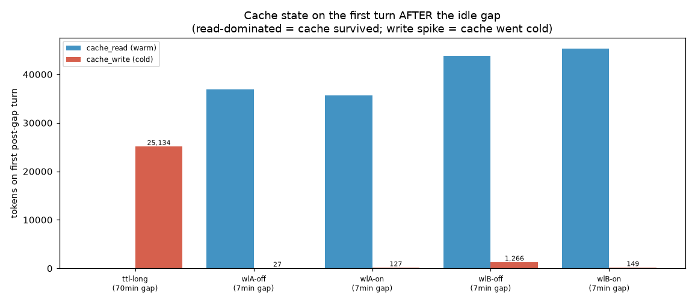
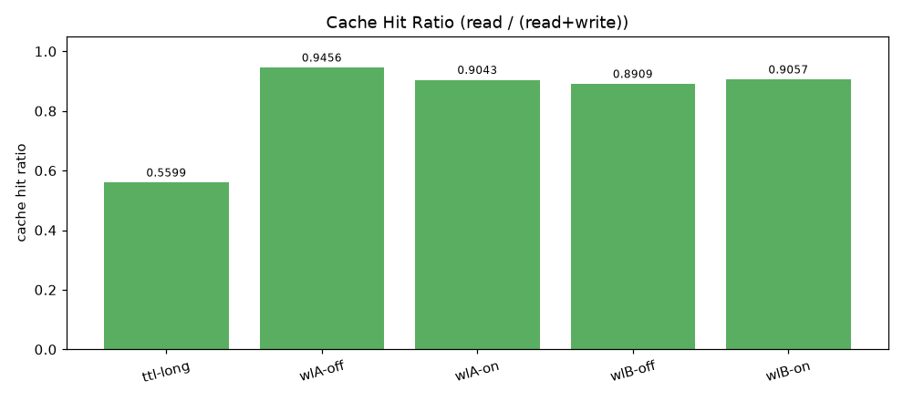
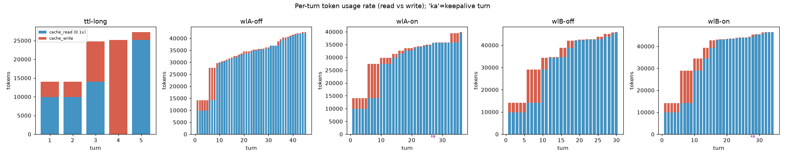
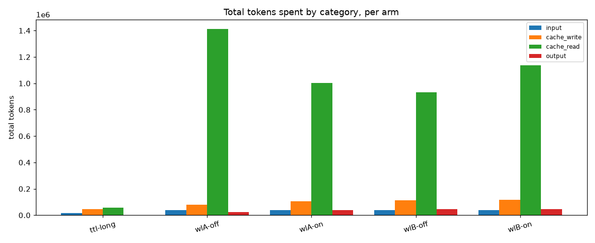
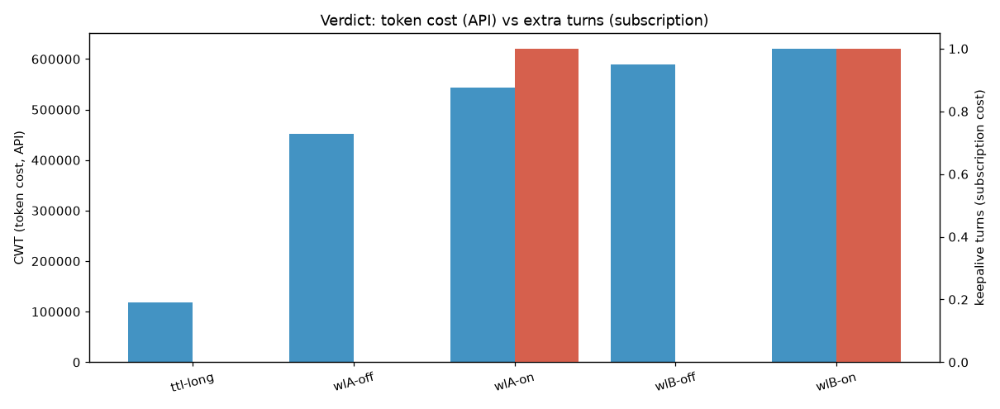

# Findings — does `cache-keepalive` save tokens here?

**Date:** 2026-06-22 · **Claude Code:** v2.1.18x · **Plan:** Claude Pro (subscription) · **Model:** Opus 4.8
**Method:** 5 live nested `claude` sessions driven via pexpect, real idle gaps. See
[`00-experiment-design.md`](./00-experiment-design.md) and [`theory.md`](./theory.md).

---

## TL;DR verdict

> **In this environment the plugin saves nothing and costs you quota.** Claude Code here writes the prompt
> cache with a **1-hour TTL**, so a normal idle pause (we tested 7 minutes) leaves the cache **fully warm on
> its own**. The keepalive plugin's pings are therefore redundant — and each ping is a **real request** that
> burns subscription quota. The plugin's mechanism *does* work (we watched a keepalive turn cheaply re-read
> the cache), and it *would* pay off **if** the TTL were 5 minutes (we measured that the cache really does go
> cold after ~1 hour) — but that precondition is false here.

| Situation | Without plugin | With plugin | Winner |
| :-- | :-- | :-- | :-- |
| **This env (1h TTL), 7-min gap** | cache stays warm, 0 extra turns | cache stays warm, **+1 keepalive turn/gap** | **Without** (plugin = pure overhead) |
| Hypothetical 5-min TTL, 7-min gap | cache goes cold → full rewrite | 1 cheap read keeps it warm | With (the case the plugin is built for) |
| This env, **>1h** gap | cache goes cold (measured!) | default config (≤28 min) **can't cover it** | Neither at default settings |

---

## 1. The decisive evidence: cache state on the first turn *after* the gap

The cleanest, least-confounded measurement is the **first real turn after the idle gap**: if its input is
`cache_read`-dominated, the cache survived; if it spikes `cache_creation` with `read≈0`, the cache went cold.



| arm | gap | post-gap turn | `cache_write` | `cache_read` | cache state |
| :-- | :-- | :-- | --: | --: | :-- |
| **ttl-long** | **70 min** | t4 | **25,134** | **0** | **COLD — full rewrite** |
| wlA-off | 7 min | t31 | 27 | 36,858 | warm |
| wlA-on | 7 min | t28 | 127 | 35,716 | warm |
| wlB-off | 7 min | t27 | 1,266 | 43,791 | warm |
| wlB-on | 7 min | t29 | 149 | 45,264 | warm |

This single table is the whole story:
- **7-minute gap → cache warm in every arm**, plugin or not. The ON arms gain nothing the OFF arms didn't
  already have for free.
- **70-minute gap → cache cold** (`read=0`, a 25k-token rewrite). The cache *does* expire — but only well
  past the 5-minute mark the plugin is tuned for. This empirically brackets the TTL between 7 min and 70 min,
  consistent with the documented **1-hour** value.

## 2. Every cache write used the 1-hour TTL

Across **all 5 arms and ~150 turns**, the `usage.cache_creation` breakdown was:

```
ephemeral_5m_input_tokens : 0          (0%)
ephemeral_1h_input_tokens : 466,136    (100%)
```

Not a single 5-minute write. The plugin's core premise ("beat the 300 s TTL") simply does not apply to this
install. (This matches the pre-experiment scan of historical transcripts in [`theory.md`](./theory.md) §6.)

## 3. The keepalive mechanism works — it's just pointless here

Each ON arm fired exactly **1 keepalive turn** in the 7-minute gap (at the faithful 240 s interval; the
`keepalive.log` confirms `Stop fired, sleeping 240s … blocking Stop with keepalive message (1/7)`). That turn
behaves exactly as designed — a cheap cache **read**:

| arm | keepalive turn | `cache_write` | `cache_read` | `output` |
| :-- | :-- | --: | --: | --: |
| wlA-on | t27 | 25 | 35,691 | 22 |
| wlB-on | t28 | 909 | 44,355 | 54 |

~35–44k tokens **read** at 0.1×, ~20–50 tokens out. So the trick is real. But in a 1h-TTL world the cache it
"refreshes" wasn't going to expire anyway — it refreshes something that didn't need refreshing.

## 4. KPI summary (per arm)



| arm | turns (real / keepalive) | write | read | **CHR** | CWT | ECM |
| :-- | :-- | --: | --: | --: | --: | --: |
| wlA-off | 45 / 0 | 81,247 | 1,412,539 | 0.946 | 452,365 | 0.275 |
| wlA-on | 35 / **1** | 106,143 | 1,002,420 | 0.904 | 543,828 | 0.406 |
| wlB-off | 30 / 0 | 114,045 | 931,248 | 0.891 | 589,757 | 0.449 |
| wlB-on | 33 / **1** | 118,392 | 1,137,317 | 0.906 | 620,470 | 0.407 |
| ttl-long | 5 / 0 | 46,309 | 58,914 | **0.560** | 119,041 | 0.947 |

- **CHR (cache hit ratio)** is the clean cross-arm signal: the 7-min arms all sit at **0.89–0.95** (warm),
  while the 70-min arm collapses to **0.56** (cold). The plugin does **not** lift CHR — `wlA-on` (0.904) is
  not meaningfully different from `wlA-off` (0.946); the small differences are workload noise, not cache
  effects.
- ⚠️ **Do not read the raw `write/read/CWT` totals as an A/B result.** The agent did a *different amount of
  work* each run (45 vs 35 turns for WL-A, etc.) — Claude is non-deterministic. Totals are confounded by turn
  count. That is exactly why the **per-turn gap-boundary** (§1) and **CHR** are the load-bearing metrics, not
  the totals charts below.




## 5. The two costs, side by side (the verdict chart)



- **Token cost (API-billing counterfactual):** essentially unchanged between ON and OFF at 7-min gaps,
  because the cache was warm regardless.
- **Subscription cost (what your plan actually meters):** each ON arm spent **+1 request** on a keepalive
  turn that bought nothing. The plugin's default `max_loops_per_turn=7` means a single long think-pause can
  spend **up to 7 requests** against your 5-hour quota for zero benefit. On Pro/Max this is strictly negative.

## 6. The 5-minute-TTL counterfactual (when the plugin *would* win)

The plugin is not snake-oil — it solves a real problem that just isn't present here. Our **ttl-long t4** is a
direct measurement of what a cold cache costs: a **~25k-token full rewrite** (`read 0 → write 25,134`).

If this environment used a **5-minute** TTL, every 7-minute gap would look like ttl-long t4. Per gap, in
weighted-token terms on a ~36k prefix:

```
cold rewrite (no plugin) : 36k × 1.25  ≈ 45,000  weighted tokens
keepalive read (plugin)  : 36k × 0.10  ≈  3,600  weighted tokens + ~30 output
                                         ----------------------------------
plugin saving per gap    : ≈ 41,000 weighted tokens, at the price of +1 request
```

That is a large API-dollar saving **per idle gap** — the Aider/Cline/SillyTavern result — and it is why the
plugin exists. The lever simply isn't connected to anything on a 1h-TTL subscription install.

## 7. Could it ever help here? Only mis-configured-against-itself

The only regime where the cache actually expires here is gaps **> ~1 hour** (§1). But the plugin's defaults
(`interval 240 s × max_loops 7 ≈ 28 min` of coverage) **cannot span a >1h gap** — it would stop pinging at
28 minutes and let the cache die anyway. So at stock settings the plugin is simultaneously *unnecessary* for
the gaps it can cover (<28 min, cache already warm) and *insufficient* for the only gaps that matter (>1 h).
You would have to deliberately re-tune it to a regime it wasn't shipped for, and even then you'd be paying
request-quota on a subscription where the token saving isn't billed.

## 8. Methodology notes (hard-won; reproducibility)

Driving a real interactive Claude Code session unattended surfaced several non-obvious requirements, all now
encoded in `harness/`:

1. **Scrub inherited `CLAUDE_CODE*` / `CLAUDECODE` env.** A nested session that inherits these runs as a
   *child session* and **never persists a transcript** — the entire measurement substrate vanishes silently.
2. **Continuously drain the PTY.** If the reader thread stops, the child blocks on a full output buffer
   before it can process input.
3. **Bypass-permission mode is un-automatable via PTY.** It shows a non-persistable warning dialog, and the
   TUI uses the Kitty keyboard protocol so arrow-key navigation is unreliable. We use
   `--allowedTools "<all standard tools>"` instead — same unattended autonomy, no dialog. (Identical
   cache/token behavior; this is a harness detail, not a confound.)
4. **Detect turn completion from the transcript**, not the TUI: an assistant message with
   `stop_reason ∈ {end_turn, stop_sequence}` beyond a pre-send baseline.
5. **Detect REPL readiness** before typing (fresh worktrees show onboarding/release-notes), and verify the
   prompt text landed before pressing Enter.

## 9. Limitations

- **n = 1 per arm.** Single runs; Claude's non-determinism means totals vary. We mitigated by relying on
  per-turn gap-boundary state and CHR, which are robust to turn count, not on cross-arm totals.
- **One long-gap arm.** The 70-min cold-cache result is a single, unambiguous observation (read→0), but it
  pins the TTL only to "between 7 and 70 min," not to the exact minute.
- **TTL is environmental and not contractual.** Anthropic changed it before (1h→5m in 3/2026) and could
  again. If a future Claude Code reverts this install to a 5-min TTL, re-run `harness/run-all.py`; the §6
  counterfactual predicts the plugin would then start paying off on **API-billed** usage (still not on
  subscription).

---

### Bottom line
On this 1-hour-TTL, subscription-billed install, **leave the plugin off.** It cannot save tokens it isn't
losing, and every keepalive ping is a request you don't get back. Revisit only if you move to **API-key
billing** *and* observe 5-minute (`ephemeral_5m`) cache writes in your transcripts.
